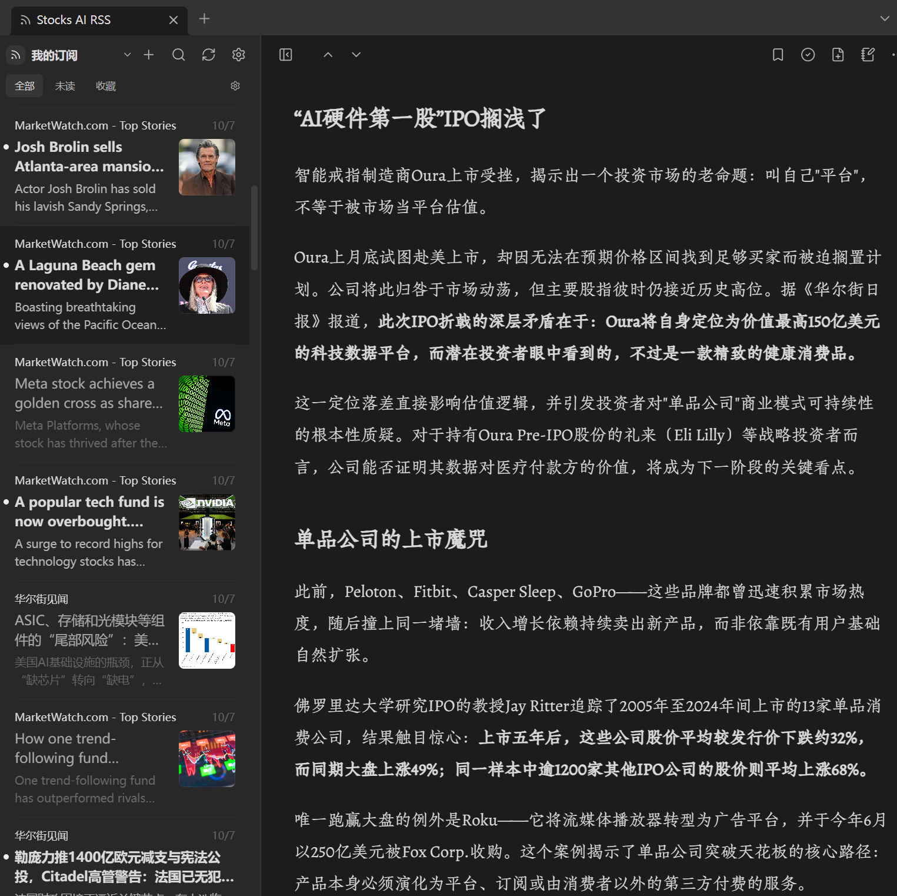

**[中文](README.md) | [English](README.en.md) | [日本語](README.ja.md)**

<div align="center">

# 📈 Stocks AI RSS

**米国株・AI・半導体・金・BTC——5 つのテーマの市況ニュースを、あなたの Obsidian へ**

[](https://github.com/Serennity007/serenity-stock-rss/releases)
[](LICENSE)

[](https://github.com/joeseesun/qiaomu-ai-rss)


*無料 · オープンソース · アカウント不要 · 完全ローカル · 内蔵フィード 31 件*

**本プロジェクトは [向阳乔木](https://github.com/joeseesun) 氏の [Qiaomu AI RSS](https://github.com/joeseesun/qiaomu-ai-rss) を学んでフォーク・改良したものです。リーディング体験の功績は原作者のものです 🙏**



</div>

---

投資判断は情報の質で決まります。しかし現状はこうです：AI の速報は X に、半導体の深掘りは有料レポートに、BTC の噂は無数のグループチャットに、金相場はトレーディングアプリの中——**読んだそばから散り、ナレッジベースには何も残らない**。

**Stocks AI RSS** はそのループを Obsidian の中で完結させます。**HTTPS 直接接続を 1 件ずつ検証した 31 の金融フィード**を 5 つのテーマに整理し、価値のある記事はワンクリックで Markdown ノートに、気になる一節はデイリーノートに保存。[Qiaomu AI RSS](https://github.com/joeseesun/qiaomu-ai-rss) の成熟したリーディング体験をベースに——「RSS を読む → ノートに残す」を極めたその設計の上に、投資リサーチ向けの姿へと作り替えました。

## 🔥 5 テーマ、ワンクリック購読

| テーマ | 内蔵フィード | 読める内容 |
| --- | --- | --- |
| 🇺🇸 **米国株** (8) | CNBC ×3 · MarketWatch · WSJ ×2 · Seeking Alpha · Fortune | 市場の動き、決算シーズン、個別株ニュース |
| 🤖 **AI・大規模モデル** (5) | OpenAI · TechCrunch AI · Interconnects · Simon Willison · 量子位 | モデル公開、AI スタートアップの資金調達、LLM 研究、中国語 AI ビジネス |
| 💾 **半導体** (4) | SemiAnalysis · Tom's Hardware · SemiWiki · EE Times | 計算基盤のサプライチェーン、プロセスノード、チップ設計 |
| 🪙 **金・暗号資産** (6) | MINING.com · FXStreet · The Block · Cointelegraph · Bitcoin Magazine · Decrypt | 金の供給側、BTC 市場、機関採用と規制 |
| 🏛️ **マクロ** (3) | CNBC Economy · 米連邦準備制度 · SEC | FOMC、雇用・インフレ指標、ルールメイキング |

補助コレクションとして **中国語金融**（華爾街見聞、新浪財経、钛媒体（TMTPost））と **金融ブログ**（Ben Carlson、Josh Brown）を含め、合計 **31 フィード**。公式 RSS のない雪球・財聯社などは、自前の [RSSHub](https://docs.rsshub.app/) で生成した URL を探索パネルに貼って追加できます。

## ✨ 保管庫に常駐する価値

- ✍️ **情報から知識への最後の一歩** — 記事をワンクリックで Markdown ノートに保存（画像もローカル化、リンク切れに強い）。選択した一節は出典リンク付きでデイリーノートへ追記
- 📊 **テープの隣に機関級ソース** — SemiAnalysis や Interconnects が速報フィードと同じリーダーに。アプリ間の往復はもう不要
- 🗂️ **自由な整理術** — グループ管理、OPML 入出力、保管庫フォルダーをソースとして登録（クリップしたリサーチノートも読書対象に）
- 📖 **長文のためのタイポグラフィ** — 7 テーマ、8 書体（朱雀仿宋サブセット同梱）、文字サイズ・行間・版幅調整、J/K キーボード操作
- 🔒 **完全ローカル** — アカウントもテレメトリもなし。既読・お気に入り・キャッシュは保管庫内に保存。サーバー非依存なので、このリポジトリが消えても動き続けます

## 🚀 インストール

**方法 1：BRAT（推奨、自動更新）**

1. [BRAT](https://github.com/TfTHacker/obsidian42-brat) プラグインをインストール
2. BRAT 設定 → *Add Beta plugin* → `Serennity007/serenity-stock-rss` を入力
3. コミュニティプラグイン設定で有効化

**方法 2：手動**

1. [Releases](https://github.com/Serennity007/serenity-stock-rss/releases) から `main.js`・`manifest.json`・`styles.css` をダウンロード
2. `<vault>/.obsidian/plugins/stocks-ai-rss/` に配置
3. 設定 → コミュニティプラグイン → **Stocks AI RSS** を有効化

> 上流の [Qiaomu AI RSS](https://github.com/joeseesun/qiaomu-ai-rss)（Obsidian 公式ストアで入手可能）と ID が異なるため、併用可能です。

## ❓ FAQ

**なぜこの 5 テーマなのか？**
米国株は市場の基軸、AI と半導体はこのサイクル最大の産業ナラティブ（互いにサプライチェーン）、金と BTC は法定通貨への信認の二面性。公式マクロソースと重ね合わせると、自己整合的なリサーチ面になります。質の高い中国語コンテンツは RSS を提供しないため、中国語ソースは補助コレクションに留めています。

**カタログは更新される？**
はい。ソース内のカタログは独立したデータファイル（[finance-feeds.json](src/data/finance-feeds.json)、CC0）です。フィードの追加・修正は検証結果を添えてこのファイルに PR してください。実行時には、プラグインフォルダー（`.obsidian/plugins/stocks-ai-rss/`）に `finance-catalog.json` を置くことで内蔵カタログを上書きできます。ファイルはカタログスキーマに適合し、`feeds` が空でなく、内蔵スナップショットより新しい `generated_at`（内蔵データは `YYYY-MM-DD` 形式、例 `2026-10-07`。`generated_at` がない場合は `revision` で比較）を持つ場合のみ採用されます。スキーマ不合や日付が古いファイルは無視されます。

**データは安全？**
プラグイン自身にサーバーはありません。サブスクリプションはユーザーが追加したフィード URL で、記事は保管庫内の `.obsidian/plugins/stocks-ai-rss/` に保存されます。アンインストールしても保存済みノートには影響しません。

**上流との違いは？**

| | 上流 Qiaomu AI RSS | 本フォーク |
| --- | --- | --- |
| コンテンツ | Qiaomu 厳選（オンライン）+ 個人フィード | 個人フィード + 内蔵 5 テーマカタログ |
| 中国語 AI リライト/翻訳 | あり（サーバー生成） | なし、原文のみ |
| ポッドキャスト文字起こし、リンク収集ラボ | あり | 削除 |
| ネットワーク依存 | 厳選コンテンツは要オンライン | 購読したフィードのみ |

## 🛠️ 開発

```bash
npm ci
npm run check   # eslint + vitest + tsc + esbuild
```

フィード追加や改善の PR を歓迎します — 詳細は [CONTRIBUTING.md](CONTRIBUTING.md)。

## 🙏 謝辞

- [向阳乔木 (@joeseesun)](https://github.com/joeseesun) 氏の [Qiaomu AI RSS](https://github.com/joeseesun/qiaomu-ai-rss) — 本プロジェクトは v0.26.2 のフォークで、リーディング体験のほとんどは上流の優れた設計によるものです。
- 同梱の朱雀仿宋フォントサブセットは [朱雀仿宋](https://github.com/TrionesType/zhuque)（SIL OFL 1.1）に基づきます。

## 📄 ライセンス

[GPL-3.0-only](LICENSE)。上流コードの著作権は 向阳乔木 氏に帰属し、本フォークの変更部分はリポジトリ作者に帰属します。サードパーティ表記：[THIRD_PARTY_NOTICES.md](THIRD_PARTY_NOTICES.md)。
